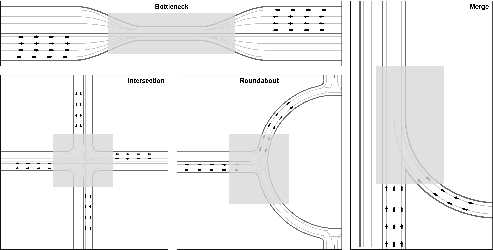

# universe

## Clone this repo
```bash
git clone https://github.com/alibaba-damo-academy/universe.git
cd universe
```


## Requirements

```bash
conda create --name universe python=3.7.7 -y
conda activate universe

pip install -r requirements.txt
```

## Installation

```bash
pip install -e .
```


## demo

- Run demo code:
```bash
cd scripts
python run_env.py --render
```

- Build-in scenarios:

<p align="center"><br><em>The initial poses (makred as black arrows) and interaction zone (marked as gray rectangles) of each scenario.</em></p>

